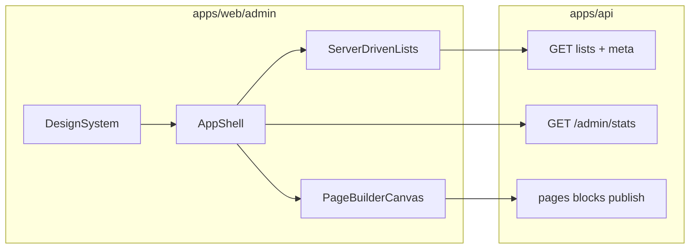

# بک‌لاگ فرانت CMS + اتصال به بک‌اند

| فیلد | مقدار |
|------|--------|
| محدوده | `apps/web/admin` + ارتقای قرارداد API لازم |
| پیش‌نیاز | بک‌اند فاز ۱ آماده |
| وضعیت کلی | در انتظار اجرا |

**خلاصه:** توسعه پنل ادمین Next.js با دیزاین‌سیستم کامپوننت‌محور (بدون HTML خام برای کنترل‌ها)، اتصال کامل به API، فیلتر/سورت/سرچ فقط سمت بک‌اند، اسکلتون‌های layout-match، و صفحه‌ساز بوم+سایدبار — همراه با ارتقای قرارداد pagination و endpoint آمار داشبورد در API.

---

## وضعیت فعلی

[`apps/web/admin`](../apps/web/admin) فقط اسکلت placeholder است. بک‌اند فاز ۱ آماده است؛ چند ارتقای قرارداد API برای داشبورد و pagination کامل لازم است.

## تصمیم‌های ثابت UI/UX

- دیزاین‌سیستم روی **Radix UI primitives + کامپوننت‌های داخلی Tailwind** (الگوی shadcn): Select / Combobox / Switch / Checkbox / Dialog / Dropdown / Tabs / Tooltip / Toast — **هیچ `<select>` / checkbox خام / toggle خام** در صفحات CMS مجاز نیست.
- زبان بصری: RTL فارسی، برند آگروهوم (سبز تیره + زرد اکسنت موجود در main)، تایپوگرافی غیرسیستمی، سطوح با hierarchy واضح، motion کوتاه و هدفمند.
- فیلتر / سورت / سرچ / صفحه‌بندی **فقط با query به API**؛ فرانت state UI را نگه می‌دارد و درخواست می‌زند، داده را لوکال فیلتر نمی‌کند.
- لودینگ: Skeletonهایی که **همان ساختار ردیف جدول / کارت / فرم** را تقلید کنند (layout-stable).
- لیست‌ها همیشه از meta pagination می‌خوانند؛ شمارنده‌های داشبورد از endpoint سبک stats — نه fetch کل لیست.

---

## Epic 0 — قرارداد API برای CMS (پیش‌نیاز)

- [ ] 0.1 یکسان‌سازی پاسخ لیست: `{ content, total, meta: { page, limit, totalPages } }` در helper و همه listهای admin/public
- [ ] 0.2 اطمینان همه GETهای لیست ادمین (از جمله `users`، nested در صورت نیاز جدا) از `page/limit/sort/search/filters` پشتیبانی می‌کنند
- [ ] 0.3 `GET /api/v1/admin/stats` سبک: شمارنده‌های کلیدی (`products`, `blogs`, `commentsPending`, `contactsNew`, `pages`, `media`, …) با `count` فقط
- [ ] 0.4 پشتیبانی `fields=meta` یا `limit=0` برای گرفتن فقط pagination/meta بدون ردیف (برای badgeها در سایدبار در صورت نیاز)
- [ ] 0.5 مستند کوتاه قرارداد query/list در [`apps/api/README.md`](../apps/api/README.md)

---

## Epic 1 — اسکلت اپ ادمین و دیزاین‌سیستم

- [ ] 1.1 وابستگی‌ها: Tailwind v4، Radix primitives لازم، `class-variance-authority` / `clsx` / `tailwind-merge`، آیکون‌ها، فونت فارسی مناسب
- [ ] 1.2 توکن‌های CSS (`--admin-*`): رنگ، radius، shadow، spacing، focus ring
- [ ] 1.3 کامپوننت‌های پایه DS در `components/ui/`: Button, Input, Textarea, Label, Select, Combobox, Switch, Checkbox, RadioGroup, Dialog, DropdownMenu, Tabs, Badge, Card, Tooltip, Toast/Sonner, Separator, Skeleton, Pagination, Table shell
- [ ] 1.4 قوانین DS: ممنوعیت استفاده مستقیم از کنترل‌های native در featureها (eslint rule ساده یا convention در README ادمین)
- [ ] 1.5 App Shell: Sidebar + Topbar + Content؛ ناوبری entityها؛ حالت collapsed موبایل با Drawer از DS
- [ ] 1.6 تم RTL، layout root، providers (toast، theme tokens)

---

## Epic 2 — لایه داده و Auth

- [ ] 2.1 کلاینت API با `credentials: 'include'` و baseURL از `NEXT_PUBLIC_API_URL`
- [ ] 2.2 تایپ‌های مشترک پاسخ لیست (`ListResponse<T>`) در admin یا `@agrohome/shared`
- [ ] 2.3 هوک/هلپر `useServerQuery` برای sync کردن `page/limit/sort/search/filters` با URL searchParams (منبع حقیقت URL)
- [ ] 2.4 صفحات `/login`: OTP (نمایش راهنمای کد در dev) + لاگین password؛ بدون کنترل خام
- [ ] 2.5 گارد کلاینت: `/auth/me` → بدون نقش ریدایرکت لاگین؛ loading با skeleton شل
- [ ] 2.6 Logout از Topbar

---

## Epic 3 — الگوی فهرست/فرم CRUD (عمومی)

- [ ] 3.1 `DataToolbar`: Search + Filter chips/Selectها + Sort — همه فقط پارامتر API
- [ ] 3.2 `DataTable` + `Pagination` مصرف‌کننده `total/meta.totalPages/meta.page`
- [ ] 3.3 Skeletonهای اختصاصی: TableSkeleton (همان تعداد ستون)، FormSkeleton، CardGridSkeleton
- [ ] 3.4 `ResourceForm` الگوی create/edit با Dialog یا صفحه جدا؛ validation سمت UI + خطای API
- [ ] 3.5 Confirm حذف با Dialog DS؛ Toast موفقیت/خطا
- [ ] 3.6 Empty state و Error state یکدست

---

## Epic 4 — ماژول‌های موجودیت (CRUD وصل به API)

هر ماژول: لیست server-driven + فرم + skeleton + بدون فیلتر لوکال

- [ ] 4.1 محصولات + روابط دسته/تگ/بسته/مشخصات
- [ ] 4.2 دسته‌بندی محصول (درخت از endpoint nested؛ mutation از CRUD)
- [ ] 4.3 بسته‌ها / مشخصه‌ها / مشخصات محصول
- [ ] 4.4 تگ و موضوع تگ
- [ ] 4.5 وبلاگ و دسته‌بندی وبلاگ
- [ ] 4.6 نظرات: فیلتر publish از API، publish/unpublish، پاسخ ادمین
- [ ] 4.7 SEO
- [ ] 4.8 کاربران و نقش‌ها (assign-role طبق قانون PRD)
- [ ] 4.9 پیام‌های تماس + تغییر status از API

---

## Epic 5 — کتابخانه رسانه

- [ ] 5.1 گرید رسانه با skeleton کارت‌شکل
- [ ] 5.2 آپلود multipart + فیلد `alt` اجباری/توصیه‌شده در فرم DS
- [ ] 5.3 ویرایش alt/name؛ پیش‌نمایش تصویر
- [ ] 5.4 انتخابگر رسانه قابل‌استفاده در فرم‌های دیگر (Dialog از DS)

---

## Epic 6 — صفحه‌ساز CMS (بوم + سایدبار)

- [ ] 6.1 فهرست صفحات و regions + publish
- [ ] 6.2 ادیتور صفحه: بوم پیش‌نمایش بلوک‌ها به‌ترتیب `sortOrder`
- [ ] 6.3 کلیک روی بلوک → سایدبار تنظیمات (type-specific form از DS)
- [ ] 6.4 افزودن/حذف/reorder بلوک‌ها (API reorder) با feedback بصری
- [ ] 6.5 پشتیبانی `STATIC` / `ENTITY_QUERY` / `ENTITY_REF` در سایدبار (انتخاب entity و فیلترها از API)
- [ ] 6.6 Publish + نمایش وضعیت draft/published؛ skeleton بوم هنگام لود editor

---

## Epic 7 — داشبورد

- [ ] 7.1 کارت‌های آمار فقط از `GET /admin/stats` (نه لیست کامل)
- [ ] 7.2 اسکلتون کارت‌های آمار هم‌اندازه حالت پر
- [ ] 7.3 لینک سریع به entityها و صفحه‌ساز
- [ ] 7.4 (در صورت نیاز) badge شمارنده در سایدبار با `limit=0`/`fields=meta` یا همان stats

---

## Epic 8 — کیفیت، دسترس‌پذیری، آمادگی استفاده

- [ ] 8.1 کیبورد/focus ring روی همه کنترل‌های DS؛ لیبل‌های فارسی
- [ ] 8.2 حالت‌های خطا شبکه و 401 سراسری
- [ ] 8.3 README ادمین: ساختار DS، قرارداد URL query، اتصال env
- [ ] 8.4 چک نهایی: هیچ کنترل native در features؛ هیچ sort/filter کلاینتی روی آرایه؛ همه لیست‌ها pagination meta دارند

---

## تعریف Done

1. ادمین با OTP/password وارد پنل مدرن RTL می‌شود.
2. همه entityهای فاز ۱ با لیست/فرم DS و skeleton مدیریت می‌شوند.
3. فیلتر/سورت/سرچ فقط از بک‌اند می‌آید؛ داشبورد بدون fetch سنگین است.
4. صفحه‌ساز بوم+سایدبار به API وصل است و publish کار می‌کند.
5. آماده اتصال تدریجی `apps/web/main` به API عمومی (خارج از این بک‌لاگ، مگر نیاز فوری).
